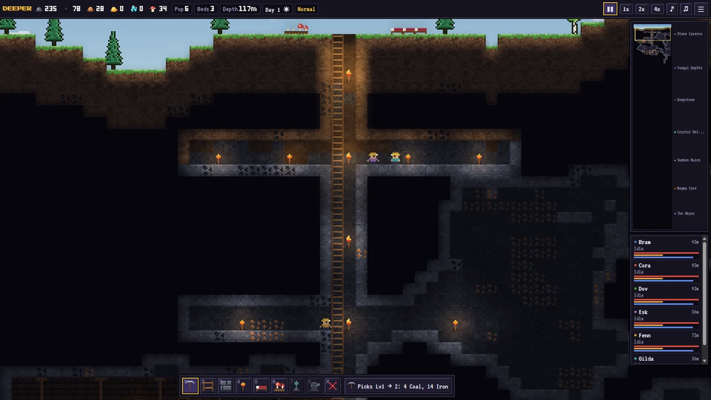
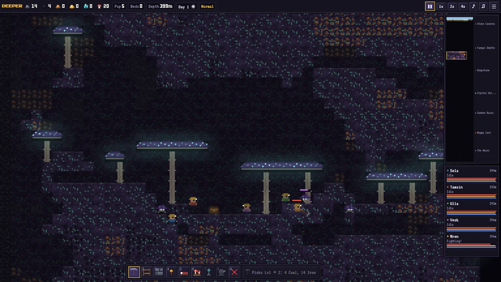
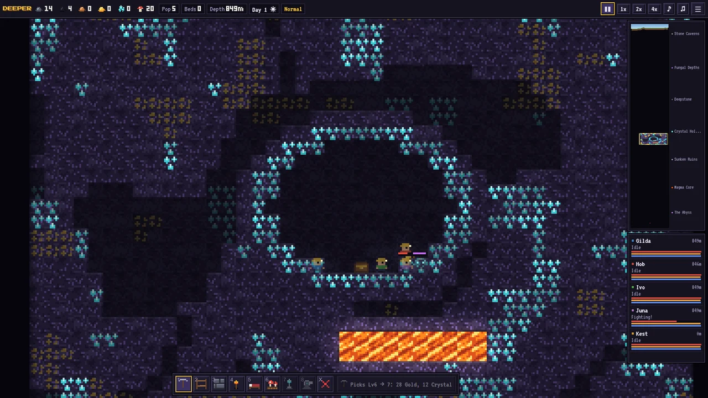
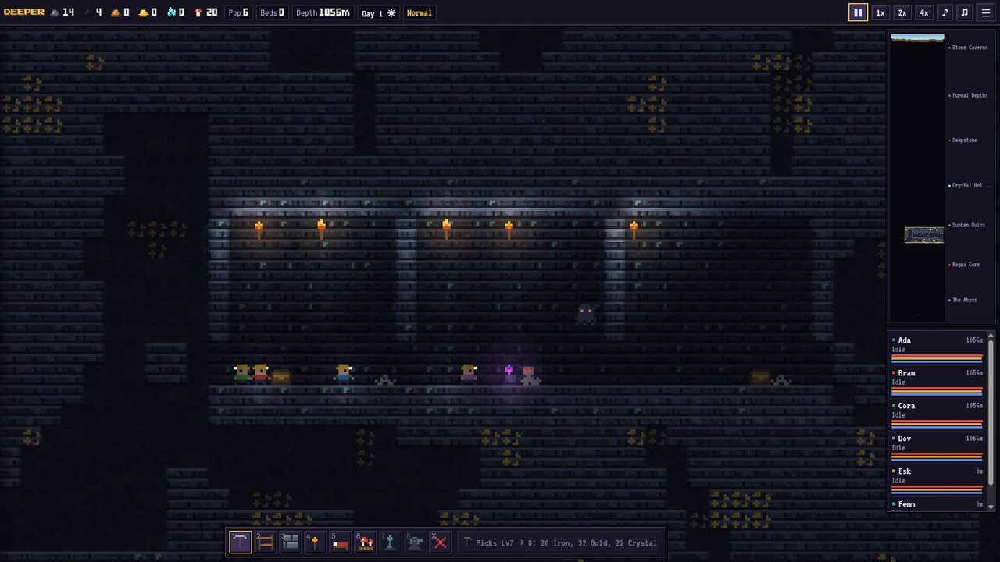
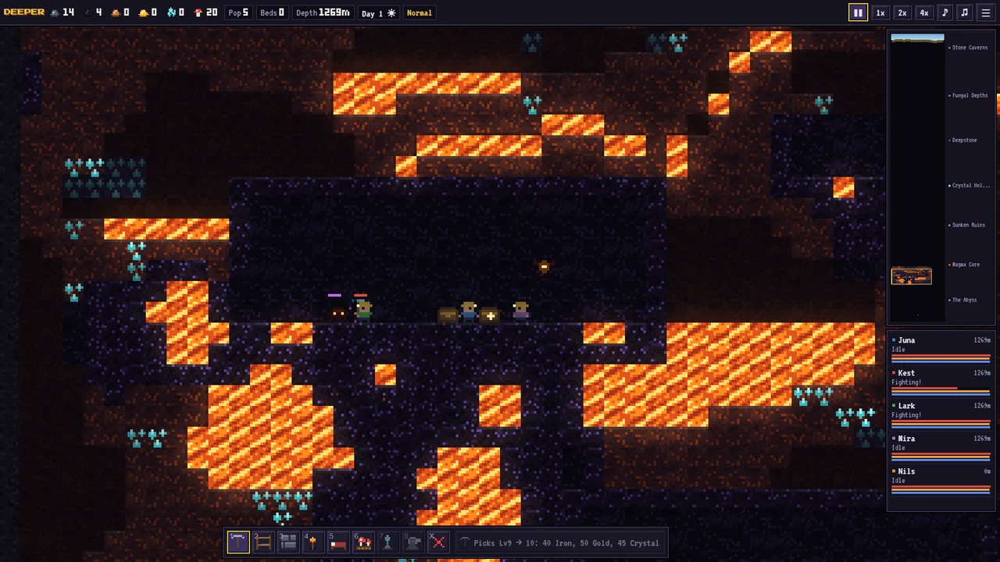

# DEEPER

**A pixel-art colony survival game where the only way is down.**

▶ **[Play the free demo in your browser](https://play.steriumai.dev)** · 🌐 [steriumai.dev](https://steriumai.dev) · Full game planned at US$5 for Windows, Linux and Android

## In plain words

DEEPER is a small strategy game you can play for free in your browser. You don't control the miners directly: you
tell them where to dig and what to build, and they get on with it — eating, sleeping and fighting on their own. The
goal is to guide the colony safely to the bottom of the world. It's built from scratch without a game engine, so the
whole demo loads almost instantly, even on a phone.

Lead a band of miners 1,500 metres into the earth. Mark tiles and your colonists dig, build and fight on their
own: ladders so they can climb back up, torches to hold back the dark, mushroom beds to feed them and beds to rest.
Every tunnel you leave unlit is a place for something to crawl out of. At the bottom, a dragon guards the Heart of
the Deep.

| | |
|---|---|
|  |  |
|  |  |

## What's in the game

- **Eight layers**, from topsoil to the Abyss, each with its own rock, ore, creatures and dungeons
- **Autonomous colonists** with needs (food, sleep), job choice and pathfinding over ladders and ledges
- **Six kinds of dungeon** with guardians, chests, egg sacs and cursed altars
- **Twelve creatures and a boss dragon**; deeper creatures grow tougher and some stop fearing light
- **Dynamic lighting**, a day/night sky, **flowing lava** simulated as a fluid, and ambient music that darkens with depth
- Three difficulties, a guided tutorial, a codex, autosave, and **touch controls** for phones and tablets

## How it's built

- **TypeScript and the Canvas API**, bundled by Vite into one self-contained HTML file: no server, no network
  calls, no tracking
- Worlds generate from a seed; tiles, creatures, lighting, sound and music are generated in code (the dragon is a
  hand-drawn sprite sheet)
- **One codebase, three targets:** browser, desktop (Electron, Windows and Linux) and Android (Capacitor), built and
  packaged by GitHub Actions
- Made by one developer directing AI coding agents; see
  [agent-orchestrator](https://github.com/sterium-ai/agent-orchestrator) for the pipeline behind Sterium AI's work

## Under the hood

**Light is gameplay, not decoration.** Light spreads as a breadth-first flood from every torch, lamp, crystal and
colonist, losing intensity per step and stopping at solid rock. Because it flows through open cells rather than along
lines of sight, it follows the real shape of the tunnels and bends around corners. Sunlight is a separate layer that
pours down open shafts and fades with depth. The same light map drives the spawner: creatures can only appear on
revealed, underground, walkable cells darker than 12 % brightness, so *how you light your tunnels is how you defend
them*.

**Lava is a slow fluid.** Each cell holds 0–1 units of lava. On a 50 ms tick, lava falls first and then levels out
sideways, and a viscosity threshold stops thin sheets from spreading forever. Only cells in an *active set* are simulated,
and pools are generated fully enclosed, so the fluid costs nothing until a colonist digs next to one; then the pool
wakes up and pours.

**Colonists plan with one search, not many.** Movement rules model a small miner: walk, fall up to 12 tiles, step up a
one-tile ledge, scramble up a two-tile ledge, climb ladders. When a colonist looks for work it runs a single bounded
breadth-first search from where it stands and reads the distance to every candidate job from that one result, instead
of pathfinding to each job separately. A job only counts if one of its neighbouring cells is reachable, so nobody walks off to dig a tile they can't get
to, and the job a colonist already holds gets a two-tile head start so it doesn't flip-flop between two equally
close ones.

**The score reacts to the game.** The music is generated live with the Web Audio API from two layers crossfaded by a
*tension* value: calm minor and suspended chord pads with a sparse pentatonic melody, and an eerie layer of tritone
swells, a low rumble and a faint heartbeat. Tension rises with the colony's depth and with nearby creatures, and jumps
to maximum when the dragon wakes. Every sound effect is synthesized the same way; the game ships no audio files.

**Saves are small and honest.** World layers are run-length encoded and base64-packed into browser storage, and every
save carries a format version so an incompatible save is refused with a clear message instead of loading corrupted.

## Why it's useful

- It shows how far a game can go on the plain web platform: a complete colony sim, fluid, lighting and an adaptive
  soundtrack in about 5,100 lines of TypeScript, with no game engine or game framework.
- The same build runs in a browser tab, as a desktop app and as an Android app, so one fix ships everywhere.

## Curiosities

- **The entire demo is one 280 KB HTML file**, fonts and all. Engine-based web exports usually ship a multi-megabyte
  runtime before the first line of game content; here there is nothing to download but the game.
- The Android crash we fixed before launch was a timing race: on a cold start, the browser's first animation-frame
  timestamp could be *earlier* than the time taken at page load, so the game clock briefly ran backwards and asked for
  animation frame −1. One `Math.max(0, …)` fixed it.

## How it compares

Many open-source colony and mining games are built on an engine (Godot, Unity) or on a game framework, and their web
builds inherit that runtime's size and load time. DEEPER takes the opposite route: hand-written systems on the Canvas
and Web Audio APIs, so the whole game loads instantly, works offline from a single file, and needs no install, account
or network connection, not even on phones.

## This repository

The public site for the game: the free demo ([`index.html`](index.html), a single-file build), the
[privacy policy](https://play.steriumai.dev/privacy.html) and the [press kit](https://play.steriumai.dev/press.html).
The game's source code is not public.

© 2026 Sterium AI · Fonts: Press Start 2P and VT323 (SIL Open Font License, see `fonts/`)
